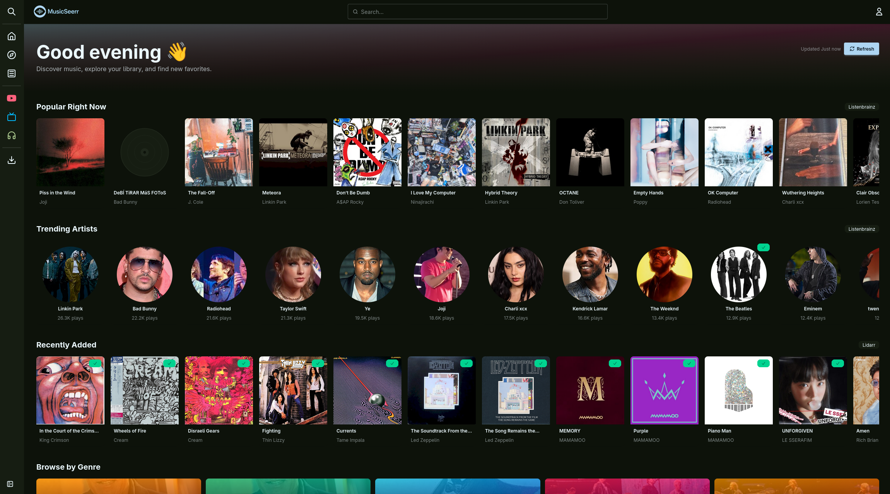
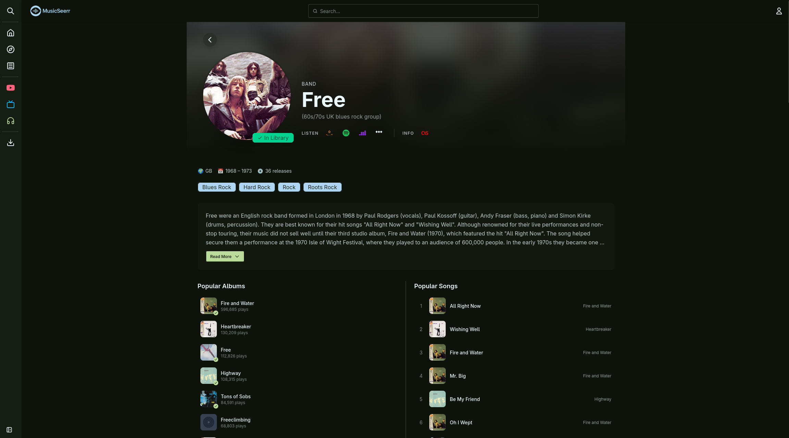
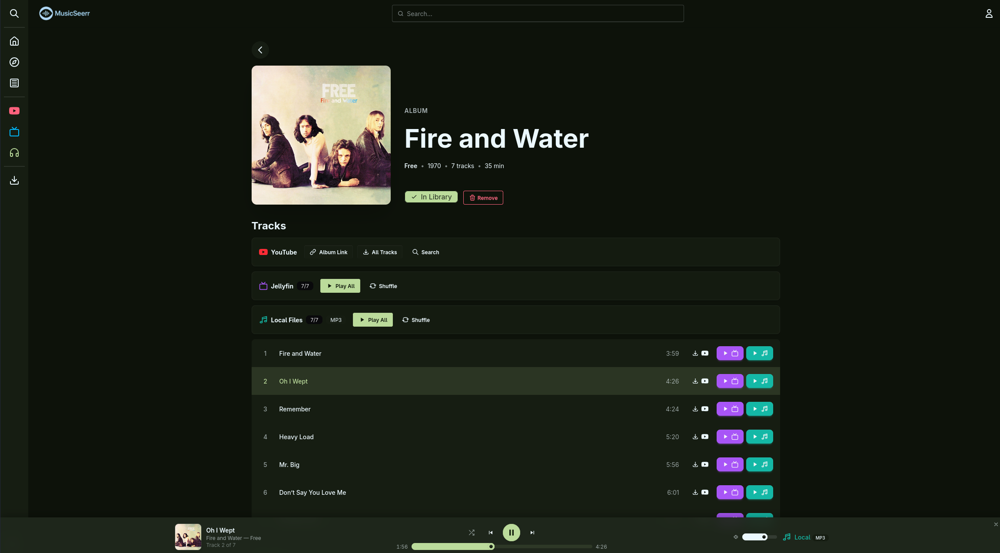
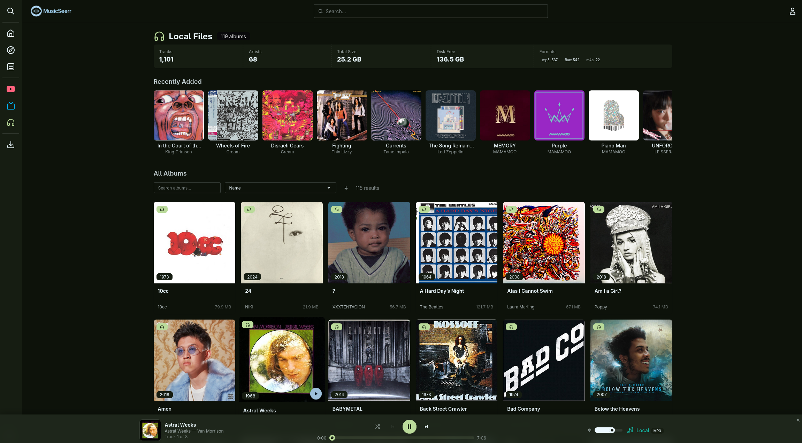

<div align="center">


[](https://ko-fi.com/M4M41URGJO)
[](LICENSE)
[](https://github.com/habirabbu/musicseerr/pkgs/container/musicseerr)

</div>

---

MusicSeerr is a self-hosted music request and discovery app built around [Lidarr](https://lidarr.audio/). Search for any artist or album, request it, and Lidarr handles the download. You can stream music directly in MusicSeerr from Jellyfin, your local music folder, or YouTube. Discovery is driven by your ListenBrainz and Last.fm listening history, and everything you play gets scrobbled back to whichever services you have connected.

---

## Screenshots






---

## Features

### Music Requests
- Search across the full MusicBrainz catalogue: artists, albums, and individual releases.
- Request any album to be downloaded via Lidarr with a single click.
- A request queue handles multiple simultaneous requests without conflicts.
- Browse all pending and fulfilled requests on a dedicated requests page.

### Player
MusicSeerr has a full in-app audio player with support for multiple playback sources per track:
- **Jellyfin** streams audio from your Jellyfin server with a configurable codec (AAC, MP3, Opus, FLAC, and more) and bitrate. Playback progress is reported back to Jellyfin automatically.
- **Local Files** plays directly from your mounted music directory, without going through Jellyfin.
- **YouTube** plays a linked YouTube album when no local copy exists yet.

### Discovery
- **Home page** shows trending artists, popular albums, recently added library items, genre browsing, and "Because You Listened To" carousels driven by ListenBrainz data.
- **Discover page** builds a queue of album recommendations from your listening history, similar artists, and gaps in your library. Each item can be expanded to show full metadata before you decide to request or skip it.
- **Genre browser** lets you explore top artists and albums within any genre.
- **Trending & Popular** shows charts of what's currently trending.

### Library
- Browse your full Lidarr-managed library by artist or album.
- View recently added albums.
- Check library statistics.
- Remove albums from your library directly in the UI.

### Scrobbling & Listen Tracking
Every track you play can be scrobbled to ListenBrainz and Last.fm simultaneously. Each service is toggled independently from settings. "Now playing" updates are sent as soon as a track starts.

### Playlists & Queuing
Build playlists and queues from your Jellyfin library, local files, and YouTube-linked albums, playable through the same player.

### Authentication
MusicSeerr supports user login and API key-based access. Most API endpoints require a valid session or API key.

### Settings
All integrations are configured through the in-app settings UI:
- Lidarr connection, sync frequency, quality/metadata profiles, root folder path.
- Jellyfin connection and API key.
- Navidrome connection.
- Local Files directory path and verification.
- ListenBrainz username and user token.
- Last.fm API key, shared secret, and OAuth session (guided in-app flow).
- YouTube API key and daily quota management.
- Scrobbling toggles per service.
- Home page layout preferences.
- Advanced cache TTL controls for both backend and frontend.

---

## Integrations

| Service | Purpose |
|-|-|
| [Lidarr](https://lidarr.audio/) | Download management |
| [MusicBrainz](https://musicbrainz.org/) | Metadata, artist info, release search |
| [CoverArtArchive](https://coverartarchive.org/) | Album artwork |
| [Wikidata](https://www.wikidata.org/) | Artist descriptions and external links |
| [Jellyfin](https://jellyfin.org/) | Audio streaming and library playback |
| [Navidrome](https://www.navidrome.org/) | Audio streaming |
| [ListenBrainz](https://listenbrainz.org/) | Listening history, discovery data, scrobbling |
| [Last.fm](https://www.last.fm/) | Scrobbling and listen tracking |
| YouTube | Album playback when no local copy exists |
| Local Files | Playback from a mounted music directory |

---

## Quick Start

### Prerequisites
- Docker and Docker Compose
- A running [Lidarr](https://lidarr.audio/) instance with an API key

### 1. Grab the compose file

```yaml
services:
  musicseerr:
    image: ghcr.io/habirabbu/musicseerr:latest
    container_name: musicseerr
    environment:
      - PUID=1000            # Run `id` on your host to find your user ID
      - PGID=1000            # Run `id` on your host to find your group ID
      - PORT=8688            # Internal port (must match the right side of "ports")
      - TZ=Etc/UTC           # Your timezone, e.g. Europe/London
    ports:
      - "8688:8688"          # Change the left side to remap to a different host port
    volumes:
      - ./config:/app/config  # Persistent app configuration
      - ./cache:/app/cache    # Cover art and metadata cache
      # Optional: mount your music library for local file playback.
      # The left side must be the same root folder path Lidarr uses.
      # The right side (/music) must match "Music Directory Path" in Settings > Local Files.
      # - /path/to/music:/music:ro
    restart: unless-stopped
    healthcheck:
      test: ["CMD", "curl", "-f", "http://localhost:8688/health"]
      interval: 30s
      timeout: 10s
      start_period: 15s
      retries: 3
```

### 2. Start it up

```bash
docker compose up -d
```

### 3. Open the UI

Open [http://localhost:8688](http://localhost:8688) and go to **Settings** to configure your Lidarr connection and any other integrations.

---

## Configuration

MusicSeerr stores its configuration in `config/config.json` inside the config volume. All settings can be managed through the in-app UI.

The following environment variables are also supported at startup:

| Variable | Default | Description |
|-|-|-|
| `PUID` | `1000` | User ID for file ownership inside the container |
| `PGID` | `1000` | Group ID for file ownership inside the container |
| `PORT` | `8688` | Port the application listens on |
| `TZ` | `Etc/UTC` | Container timezone |

### Key settings (configured in-app)

| Setting | Description |
|-|-|
| Lidarr URL | e.g. `http://lidarr:8686` |
| Lidarr API Key | Lidarr → Settings → General |
| Quality Profile ID | Lidarr quality profile to use for requests |
| Metadata Profile ID | Lidarr metadata profile to use for requests |
| Root Folder Path | e.g. `/music` |
| Lidarr Sync Frequency | How often the library cache is synced from Lidarr |
| Jellyfin URL | URL of your Jellyfin instance |
| Jellyfin API Key | Jellyfin → Dashboard → API Keys |
| Navidrome URL + credentials | For Navidrome streaming |
| Local Files Path | Mount path of your music directory inside the container |
| ListenBrainz User Token | Your ListenBrainz profile → settings |
| Last.fm API Key + Secret | Register an app at [last.fm/api](https://www.last.fm/api) |
| YouTube API Key | Google Cloud Console → YouTube Data API v3 |

---

## Playback Sources

Each track can be played from one of several sources:

### Jellyfin
Audio is transcoded on the Jellyfin server and streamed to the browser. Supported codecs: `AAC`, `MP3`, `Opus`, `FLAC`, `Vorbis`, `ALAC`, `WAV`, `WMA`. Bitrate is configurable between 32 kbps and 320 kbps. Playback start, progress, and stop events are reported back to Jellyfin.

### Local Files
Mount your music directory into the container and MusicSeerr can serve files directly. The mount path must match the **Music Directory Path** in Settings → Local Files.

```yaml
volumes:
  - /path/to/your/music:/music:ro
```

### Navidrome
Connect your Navidrome instance under Settings → Navidrome.

### YouTube
Albums can be linked to a YouTube URL and played inline via the YouTube player. Useful for albums that haven't been downloaded yet. Links can be auto-generated with a YouTube API key or set manually.

---

## Scrobbling & Listen Tracking

Every track you play gets scrobbled to whichever services you have enabled. Configure this under **Settings → Scrobbling**.

| Toggle | What it does |
|-|-|
| Scrobble to ListenBrainz | Submits a listen to ListenBrainz when a track finishes |
| Scrobble to Last.fm | Submits a scrobble to Last.fm when a track finishes |

Both services also receive a "now playing" update when a track starts.

### Setting up Last.fm
1. Register an app at [last.fm/api/account/create](https://www.last.fm/api/account/create) to get an API key and shared secret.
2. Enter them in Settings → Last.fm.
3. Click **Authorise** and follow the redirect to grant access. You'll be returned to MusicSeerr automatically.

### Setting up ListenBrainz
1. Copy your user token from [listenbrainz.org/profile](https://listenbrainz.org/profile/).
2. Enter your username and token in Settings → ListenBrainz.

---

## Discovery

The **Discover** page builds an album queue from several sources:

- **Because You've Been Listening**: artists from your ListenBrainz listening history.
- **Missing Essentials**: albums by library artists you haven't requested yet.
- **Rediscover**: albums you used to play frequently but haven't recently.
- **Similar Artists**: albums from artists related to those in your library.
- **Trending**: what's currently popular on MusicBrainz.

Each item can be expanded to show full metadata, tracklist, and artwork before you request or skip it.

The **Home** page shows:
- Trending artists across different time ranges
- Popular albums
- Recently added to your library
- Genre quick-links
- "Because You Listened To" carousels from ListenBrainz

---

## API

Swagger UI is available at `http://localhost:8688/api/docs`.

A health check endpoint is at `/health`.

API keys can authenticate requests to most endpoints, which is useful for scripts or home automation integrations.

---

## Volumes & Persistence

| Path (in container) | Purpose |
|-|-|
| `/app/config` | Application configuration (`config.json`) |
| `/app/cache` | Cover art cache, metadata disk cache, and SQLite library database |
| `/music` (optional) | Your music library root, for local file playback |

Both `/app/config` and `/app/cache` need to be mapped to persistent host directories to survive container restarts.

---

## Resource Limits

The example compose file sets a memory limit of 2 GB and 2 CPUs. MusicSeerr is fairly lightweight in normal use, but can spike during the initial library sync or cache warming. Adjust these to suit your host.

---

## Development

Python 3.13/FastAPI backend, SvelteKit 5 frontend.

### Backend

```bash
cd backend
pip install -r requirements-dev.txt
uvicorn main:app --reload --port 8688
```

### Frontend

```bash
cd frontend
npm install
npm run dev
```

### Tests

```bash
# Backend
cd backend && pytest

# Frontend
cd frontend && npm run test
```

### Linting & Formatting

```bash
# Backend — Black + isort
black . && isort .

# Frontend — Prettier + ESLint
npm run format && npm run lint
```

---

## Support

[](https://ko-fi.com/M4M41URGJO)

---

## License

MusicSeerr is licensed under the [GNU Affero General Public License v3.0](LICENSE).
